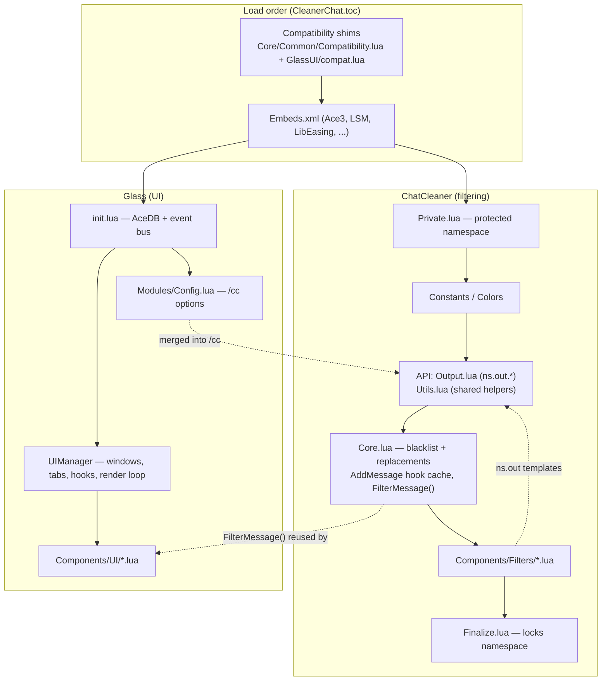

# CleanerChat Architecture

CleanerChat bundles two backported addons into one and wires them together:

- **ChatCleaner** — filters and reformats chat messages. Lives in `Core/` and
  `Components/Filters/`.
- **Glass** — replaces the default chat frame with an immersive, animated UI.
  Lives in `GlassUI/` and `Components/UI/`.

They each register their own AceAddon object and saved variables
(`CleanerChat_DB`, `GlassDB`) and meet at two small integration seams.

---

## ChatCleaner side

### Protected namespace

`Core/Private.lua` installs a metatable on the addon namespace `ns` so that a set
of "private" keys cannot be overwritten. `Core/Finalize.lua` runs last and locks
the metatable. Everything in between (`Constants`, `Colors`, `Output`, `Utils`,
the engine) populates `ns`.

### Data + API tiers

- `Core/Common/Colors.lua` — interface-version detection (`ns.Private.Is335`)
  and the color table (`ns.Colors`) with `colorCode` markup helpers.
- `Core/API/Output.lua` — **all** output format strings (`ns.out.*`), using a
  `*tag*` color-markup mini-syntax expanded from `ns.Colors`. Filters never
  hard-code color codes; they format `ns.out.*` templates.
- `Core/API/Utils.lua` — shared helpers (see table below).

### The engine (`Core/Core.lua`)

The engine maintains three callable, metatable-backed sets — `blacklist`,
`replacements`, and `specialreplacements` (the latter two built by one shared
factory) — plus a per-frame cache of each chat frame's original `AddMessage`.

- `ns:CacheMessageMethod(frame)` swaps a frame's `AddMessage` for a filtered one.
- `ns:FilterMessage(frame, msg, ...)` is **pure** (it does no rendering): it runs
  a message through the special replacements, the blacklists (drop → `nil`), and
  the replacements, returning the cleaned text. Because it is pure, the Glass UI
  reuses it so its rendered messages match the cleaned chat exactly.
- Settings live in `CleanerChat_DB`; `ns:UpgradeSettings()` versions and
  backfills them (`configversion`).

### Filters (`Components/Filters/`)

Each filter is a self-registering AceAddon module that enables on login (gated by
its `filters.*` setting) and hooks chat events and/or the AddMessage layer. They
share a common shape: a `MakePatternCache()` for WoW global-string patterns, a
proxy function, and symmetric `OnEnable`/`OnDisable` register/unregister.

Burst grouping (quest turn-ins, reputation gains) uses `ns.CreateFrameBuffer`,
which batches events that fire in the same frame and flushes once on the next.

### Shared helpers (`ns.*`)

| Helper | Purpose |
| --- | --- |
| `ns.MakePattern` / `ns.MakePatternCache` | WoW global string → Lua pattern (+ lazy cache) |
| `ns.SafeMatch` | `string.match` tolerant of a nil pattern |
| `ns.StripBrackets` | Strip `[ ]` from a link name, keep the hyperlink |
| `ns.PrintToFrame` | Emit a message colored by `ChatTypeInfo[chatType]` |
| `ns.CreateFrameBuffer` | Per-frame batching buffer with next-frame flush |
| `ns.FilterMessage` | Pure message cleaning (reused by Glass) |

---

## Glass side

### Event bus (`GlassUI/init.lua`)

Glass uses a tiny pub/sub bus instead of direct coupling: `Core:Subscribe(event,
fn)` returns an unsubscribe function, and `Core:Dispatch(event, payload)` fans
out. Event/action names live in `GlassUI/constants.lua` (`Constants.EVENTS`,
`Constants.ACTIONS`). `Core:ResolveConfigKey(payload, windowId)` centralizes the
`UPDATE_CONFIG` payload-unwrap + per-window filtering used by every subscriber.

### Settings

Glass uses AceDB (`GlassDB`). The default ("Main") window reads the flat profile;
additional windows store their own copy under `profile.windows[id]`
(`Core:GetWindowProfile` / `CreateWindowProfile` / `DeleteWindowProfile`).

### UIManager (`GlassUI/Modules/UIManager.lua`)

Owns the window registry, tab setup (mirroring Blizzard's chat frames into Glass
docks), Blizzard chrome hiding, a handful of defensive secure hooks, and the
per-frame render loop that ticks each window's container and message frames.

### Components (`Components/UI/`)

Frame factories + mixins: `SlidingMessageFrame` (the message pool + scrolling),
`MessageLine`, `ChatTab`/`ChatDock`, `EditBox`, `MoverFrame`/`MoverDialog`,
`ScrollOverlayFrame`/`NewMessageAlertFrame`, `MainContainerFrame`, `Window`, and
the `FadingFrame`/`GradientBackground` mixins. Texture coloring goes through the
shared `Utils.SetSolidColor` (3.3.5-safe, since `SetColorTexture` is polyfilled
in `compat.lua`).

---

## Integration seams

1. **Filtering reuse** — `Components/UI/SlidingMessageFrame.lua` calls
   `CleanerChat:FilterMessage()` on incoming text so the Glass display matches the
   cleaned chat and drops blacklisted lines.
2. **Options merge** — `Core/Options.lua` pulls `Glass.configGroups` into the
   single `/cc` panel, so both halves are configured in one place.

---

## Testing

Pure helpers (in `Core/API/Utils.lua`) are unit-tested with **busted** under
`spec/`. The specs load `Utils.lua` with a fake namespace and a couple of global
stubs — no WoW client required. CI runs `luacheck`, `busted spec`, a `luac`
syntax pass, TOC validation, and locale-completeness checks on every PR.
